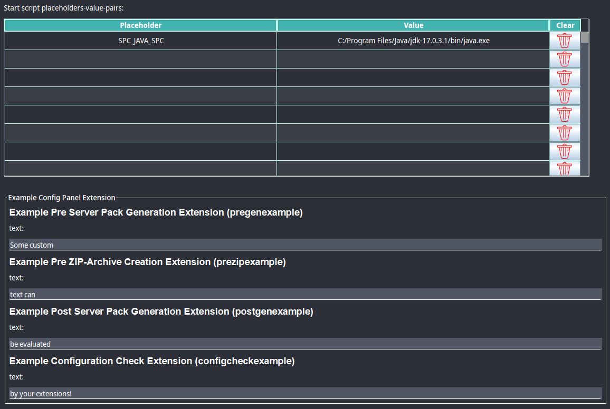
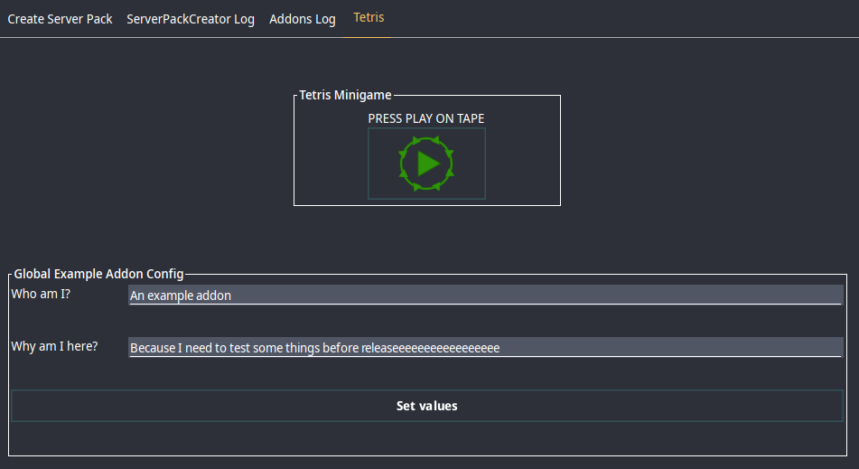
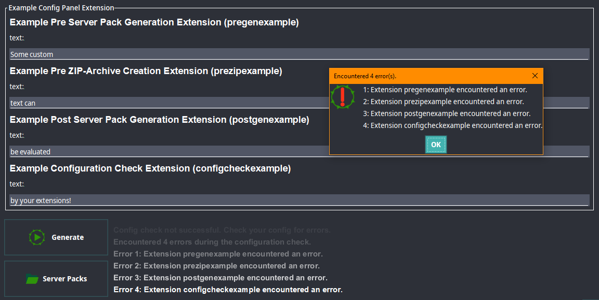
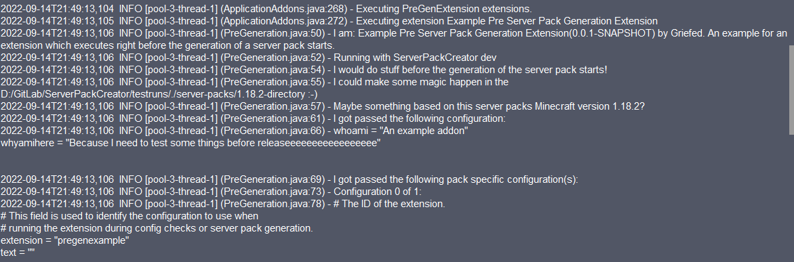
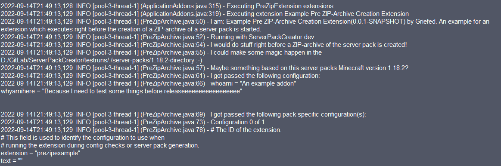
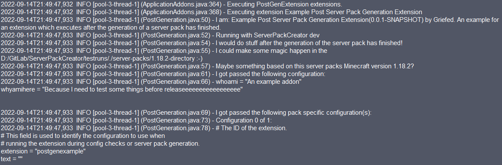

# 1. Example Addon for ServerPackCreator

This is an example server pack addon for [ServerPackCreator](https://github.com/Griefed/ServerPackCreator)

ServerPackCreator provides several extension endpoints for [pf4j plugins](https://github.com/pf4j/pf4j), from hereon out called **addons**, to add
additional functionality. This example addon demonstrates an implementation for all available extension endpoints of ServerPackCreator.

This repository demonstrates how extension for ServerPackCreator are implemented, one small example for every extension
point available in ServerPackCreator.

## 1.1 Addon details

Take care to edit this section in the `build.gradle`-file if you forked, or intent on forking, this repository.

```groovy
/*
 CHANGE THESE VALUES
    FOR YOUR OWN
       ADDON

 Addon ID must be unique.
    Set it carefully!
 */
def pluginClass = 'de.griefed.exampleaddon.Example'
def addon_id = 'example'
def addon_name = 'Example Addon'
def addon_description = 'An example addon for ServerPackCreator'
def addon_author = 'Griefed'
group 'de.griefed'
```

`pluginClass` must point at the Addon/Plugin class of your addon. Think of it as the Main-Class-attribute from a regular JARs manifest.

`addon_id` Is the ID used by ServerPackCreator to identify your addon, extensions in your addon, the global configuration-file of your addon (if you provide one) and
for identifying extension-configurations from or given to a serverpackcreator.conf. Make it as **unique** as possible.
[pf4j](https://pf4j.org/doc/plugins.html) does **not** allow for two addons with the same ID to co-exist in a given environment. The more unique
your addon-ID is, the more likely it will be able to co-exist with any other addon in a given users ServerPackCreator environment.

`addon_name` Is good for identifying a troublesome addon in the logs.

`addon_description`, `addon_author` are fancy to have and should contain a value, but they are not used by ServerPackCreator for any vital or sensitive operations.

`group` well yeah, this should obviously be changed to **your** group as you're **not** me 😅

### 1.1.1 Updating the implemented version of ServerPackCreator

It's as simple as changing the version specified in the `dependencies`-section of the `build.gradle`:

```groovy
dependencies {
    ...
    implementation 'de.griefed:serverpackcreator:3.14.0'
    ...
}
```

## 1.2 Configuration Panel Extension

The configuration panel is intended to let you add a panel in which you, or the user of your addon, may
configure something for any of the extensions added by your addon.



The above example lets you configure four textfields, one for each extension point used during server pack 
configuration checking and server pack generation. More on this in **Configuration Check Extension**.

Extension configurations are saved to the serverpackcreator.conf of the server pack and re-loaded along
with everything else, like the Minecraft version, modloader and modloader version etc.

To see how this is achieved, please see

```java
@Override
public ArrayList<CommentedConfig> serverPackExtensionConfig() {...}
``` 

and 

```java
@Override
public void setServerPackExtensionConfig(ArrayList<CommentedConfig> serverPackExtensionConfig) {...}
```

in the `ConfigurationPanel`-class.

## 1.3 Tab Extension

Tab extensions allow you to add whole tabs to the GUI of ServerPackCreator. These additional tabs are intended
to let you add textfields and such, which allow you to configure your global addon configuration.
You may add anything you want to it. The sky is the limit!



The above example adds a button which, when pressed, opens a minimalistic Tetris game in a new window.
It's not supposed to be actually that entertaining, but rather to demonstrate that you can do what you want inside
your tab.

Below the big button are some textfields which allow you to change some values of the global addon-wide configuration.
Global addon-configurations are handed to you by ServerPackCreator when the tab is instantiated. The only thing
you need to take care of is to call `saveConfiguration()` from within your tab to save the configuration.
The example above simply adds a button `Set values` which does just that. 

Global addon-configurations are passed to every extension, along with any available extension-specific configuration,
automatically, so you don't have to worry about anything other than actually saving changes you made in the tab.

Maybe have a timer auto-save every few seconds? Your tab, your choice! 😁

## 1.4 Configuration Check Extension

The configuration check extension point allows you to run your own config checks, be that on any of the
already available data from the server pack config tab, or your own data from the configuration panel, or your
own tab, or whatever else you may want to check.



The above example simply checks whether the string in `text` of the passed `CommentedConfig` in a list
of passed configs contains text. If it does, then we add a custom error message to the list of errors encountered
during configuration checks.
That list is then displayed to the user after the configurations checks have all run.

For details see `runCheck(...) {...}` in the `ConfigurationCheck`-class.

Keep in mind that the method must return `true` in order to trigger a config check failure on ServerPackCreators part.
Only if any one configuration check, be that ServerPackCreator native or from addons, returns `true` will the
error messages be displayed to the user.

Make use of this extension point in combination with the **Configuration Panel Extension** and/or **Tab Extension** in order to
check user input for any errors!

## 1.5 Pre Server Pack Generation Extension

The Pre Server Pack Generation extensions run, as the name implies, *right before* the generation of a server pack really begins.
You may use this to prepare the environment for any of the tailing extensions.



The above example shows the run of a PreGen extension, with the global addon configuration as well as the extension-specific
extension passed to it by ServerPackCreator.

See the `PreGeneration`-class for details on how the example above was achieved.

## 1.6 Pre Server Pack ZIP-archive Creation Extension

The Pre Server Pack ZIP-archive Creation extensions run, as the name implies, *right before* the creation of the server packs ZIP-archive is, or would be,
started. Want to add any files to the ZIP-archive? Or make sure some file doesn't make it into the ZIP-archive?



The above example shows the run of a PreZip extension, with the global addon configuration as well as the extension-specific
extension passed to it by ServerPackCreator.

See the `PreZipArchive`-class for details on how the example above was achieved.

## 1.7 Post Server Pack Generation Extension

The Post Server Pack Generation extensions run, as the name implies, *after* the generation of a server pack has finished.
Want to add any files to the server pack, but don't want them to end up in the ZIP-archive? Maybe download,
install and configure DynMap with some renderdata? This would be the place to do that!



The above example shows the run of a PreGen extension, with the global addon configuration as well as the extension-specific
extension passed to it by ServerPackCreator.

See the `PostGeneration`-class for details on how the example above was achieved.

See now why the ConfigPanel, ConfigCheck and Tab extensions are so nice to have?
The possibilities are (almost) **endless**!😁 

# 2. The reason for allowing ServerPackCreator to run addons:

Some people need additional functionality for their server packs, or have some additional wishes for
them. Some of those
things may not fit into the core functionality of ServerPackCreator itself.

It may also be that it is such a niche feature, that I either don't have the time to code it in, or
simply don't want to.
Maybe it doesn't fit into the overall design of ServerPackCreator, too. Who knows, it could be any
of those reasons or another.

**Hence, the addon functionality.**

This allows people to write their own addons to expand the functionality of ServerPackCreator with
their own features as
they see fit.

# 3. How

During the start of ServerPackCreator, all addons are loaded and then started. As per the pf4j
plugin lifecycle, you may use the `start()` method of your addon-class to run any operations needed
to ensure your environment is set up.
ServerPackCreator provides a nice `ServerPackCreatorExampleAddon`-class which you can extend if you so
desire. 
What it does is it prints some information about your addon during the start of ServerPackCreator,
which in turn helps you, any other addon-dev and me with debugging things. You may, of course,
choose not to extend the aforementioned class, and simply extend pf4j's `Plugin`-class, setting up
your very own addon from scratch.

For detailed documentation about Pf4j, visit https://pf4j.org/

After addons have been loaded an started by ServerPackCreator, it will list all available extensions. Depending on the mode in which ServerPackCreator is run

- additional tabs may get added the GUI
- additional panels may get added to the server pack configuration tab
- additional extensions for configuration checking and server pack generation may be added

## 3.1 Extension Endpoints

One plugin can have multiple extensions. You may add and provide as many as you like.
Currently existing endpoint and their intended purpose:

| **Extension Endpoint**                 | **Description**                                                                                                                                                                                                                                                                                                                  |
|----------------------------------------|----------------------------------------------------------------------------------------------------------------------------------------------------------------------------------------------------------------------------------------------------------------------------------------------------------------------------------|
| Configuration Check                    | Allows you to run your own, additional, configuration checks. Useful if you provide any of the other extensions and want to make them configurable.<br>The Configuration Check Extension of your addon receives the global configuration for your addon, as well as any server pack specific extension configurations available. |
| Tab Extension                          | Allows you to add an entirely new tab to the GUI of ServerPackCreator. A usage example for this: Provide configuration possibilities in case you have a global configuration for your addon.                                                                                                                                     |
| Configuration Panel                    | Allows you to add additional panels to the server pack configuration tab. A usage example for this: Your extensions have configuration you would like to be configurable on a server pack - by - server pack basis.                                                                                                              |
| Pre Server Pack Generation             | Allows you to run your own operations before the generation of a server pack starts. You may provide configurations via the previously mentioned Tab- and Configuration Panel extensions.                                                                                                                                        |
| Pre Server Pack ZIP-archive Generation | Allows you to run your own operations after the server pack was generated, but before the ZIP-archive creation would start. You may provide configurations via the previously mentioned Tab- and Configuration Panel extensions.                                                                                                 |
| Post Server Pack Generation            | Allows you to run your own operations after the generation of a server pack has finished. You may provide configurations via the previously mentioned Tab- and Configuration Panel extensions.                                                                                                                                   |

## 3.2 Data provided to extensions

Depending on the extension, different data will be supplied by ServerPackCreator, to the extension, automatically.

| **Extension Endpoint**                                                                                | **Description**                                                                                                                                                                                                                                                                                                                                                                                                                                                                                                                                                                                                                                                                     |
|-------------------------------------------------------------------------------------------------------|-------------------------------------------------------------------------------------------------------------------------------------------------------------------------------------------------------------------------------------------------------------------------------------------------------------------------------------------------------------------------------------------------------------------------------------------------------------------------------------------------------------------------------------------------------------------------------------------------------------------------------------------------------------------------------------|
| Configuration Check                                                                                   | 1. The Version Meta ServerpackCreator uses for Minecraft, Forge, Fabric, LegacyFabric and Quilt related operations.<br>2. The configuration of ServerPackCreator, ApplicationProperties.<br>3. Commonly used utilities across ServerPackCreator<br>4. Receives the configuration model which was just checked by ServerPackCreator.<br>5. A list of encountered errors during previous configuration checks to which you may add your own encountered errors, if any.<br>6. A global, addon-specific, configuration, if you've provided one.<br>6. A list of server pack-specific configurations. You may provide as many as you like, one for each of your extensions for example. |
| Tab Extension                                                                                         | 1. The Version Meta ServerpackCreator uses for Minecraft, Forge, Fabric, LegacyFabric and Quilt related operations.<br>2. The configuration of ServerPackCreator, ApplicationProperties.<br>3. Commonly used utilities across ServerPackCreator<br>4. A global, addon-specific, configuration, if you've provided one.<br>4.1. The configuration-file for your addon-wide configuration, used to load and save.                                                                                                                                                                                                                                                                     |
| Configuration Panel                                                                                   | 1. The Version Meta ServerpackCreator uses for Minecraft, Forge, Fabric, LegacyFabric and Quilt related operations.<br>2. The configuration of ServerPackCreator, ApplicationProperties.<br>3. Commonly used utilities across ServerPackCreator<br>4. The tab in which the panel(s) reside in, giving you access to its data.<br>5. A global, addon-specific, configuration, if you've provided one.<br>6. The name of your extension, used by the `ExtensionConfigPanel`-class to add a title to a titled border around your panel.<br>7. The ID of the addon which holds the extension. This is the, unique to a given environment, unique identifier of your addon.              |
| Pre Server Pack Generation,<br>Pre Server Pack ZIP-archive Generation,<br>Post Server Pack Generation | 1. The Version Meta ServerpackCreator uses for Minecraft, Forge, Fabric, LegacyFabric and Quilt related operations.<br>2. Commonly used utilities across ServerPackCreator<br>3. The configuration of ServerPackCreator, ApplicationProperties.<br>4. Receives the configuration model which was just checked by ServerPackCreator.<br>5. The destination at which the server pack was/is/will be/being generated.<br>6. A global, addon-specific, configuration, if you've provided one.<br>7. A list of server pack-specific configurations. You may provide as many as you like, one for each of your extensions for example.                                                    |

As you can see, a lot of data and information is provided by ServerPackCreator for your convenience.
If your addon provides a global configuration, you do not need to take care of it, manage it, ensure
it exists or load it. ServerPackCreator will extract it and provide any and all of your extensions
with it, so you may use, change, overwrite and save it as you so desire.

Furthermore, any server pack specific configuration provided by you via a Configuration Panel will
be stored in the server pack related configuration file, along with any other default fields of
ServerPackCreator. When said configuration file is then loaded, your Configuration Panel extension
is again, automatically, provided with your extension configurations. No need to load it yourself,
all you have to make sure is to provide the changed data back to ServerPackCreator for when a given
user saves their configuration.

See [pf4j documentation](https://pf4j.org/doc/extensions) on extensions.

## 3.3 Global addon configuration

This example contains a `config.toml`-file which serves as a global configuration for your addon and
any extensions it provides. As mentioned previously, every one of your extensions will receive this
global configuration and in order for it to be changeable, you need to provide a suitable TabExtension.

If you intend on using the global configuration, bear in mind:
1. to **not** rename the file yourself. ServerPackCreator extracts it from your addon and stores it under a different filename, matching your addons ID
2. that your addon ID should be as unique as possible. Duplicate IDs will cause conflicts with other addons which have the same ID as yours
3. pf4j relies on each addon to have a unique ID, otherwise pf4j will encounter issues if multiple addons with the same ID are provided
4. Change the ID in `build.grdle`, in the `def addon_id`-section. Change the other values accordingly, too

ServerPackCreator will manage and provide the global configuration itself. You simply have to take
care to provide, change and use the values therein.

## 3.4 Addon identification

The `addon.toml`-file contains values by which to identify your addon in the logs. Do not edit this
file manually, as the `processResources`-task will automatically replace the values with the ones
you set in the `def <key>`-section.

As well as with the `addon.toml`-file, your addon#s manifest must contain specific information. This
information is also automatically replace.

Again, make sure to change the values in the `def <key>`-section!

## 3.5 Logs

If you want to print log messages, then use the `LOG_ADDONS` logger as shown in this example. This
will result in ServerPackCreator writing any and all log entries from this logger to
the `addons.log`-file.

# 4. Building

1. Fork and clone this repository
2. Make your changes and additions.
3. Build with `gradlew clean build --info --stacktrace`.
4. Copy the JAR-file from `build/libs` to the plugins-directory created by ServerPackCreator.
5. Run ServerPackCreator!

# 5. Contributing

If you have written an addon, let me know by creating an issue in this repository. Provide a short
description of what your
addon does and a link to the GitHub repository as well. I will add it to a list in the README of
ServerPackCreator.

**NOTE: I only add addons which are open source. I will NOT add any direct download links to any
file. People must be able
to check your code before they download and install your addon, and as such, I will only add a link
to your addon-respository
along with a small description, if you provided one.

Example:

| Addon                                                                                    | Creator | Description                                                                                             |
|:-----------------------------------------------------------------------------------------|:--------|:--------------------------------------------------------------------------------------------------------|
| [ExampleAddon](https://github.com/Griefed/ServerPackCreatorExampleAddon)                 | Griefed | An example addon providing a starting point for addon development with one example for every extension. |
