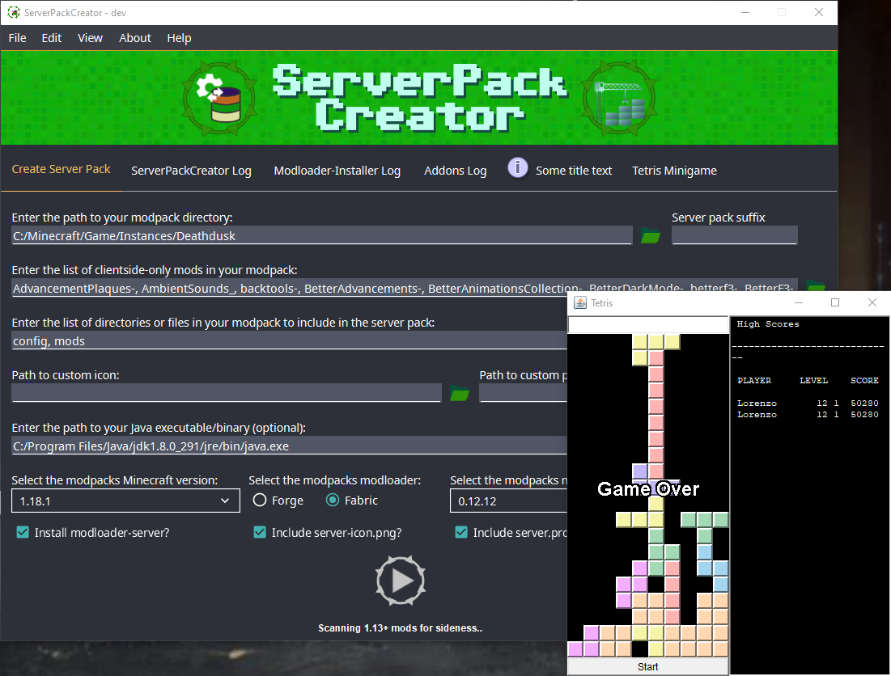

# Example Addon for ServerPackCreator

This is an example server pack addon for [ServerPackCreator](https://github.com/Griefed/ServerPackCreator)

This plugin adds a single simple tab containing but a single button. "Press Play On Tape".
Upon pressing said button, you can play Tetris in a new windows!

Playing Tetris whilst a server pack is generating? Yes please!

HUGE shoutout to Per Cederberg for providing the code at [java2s](http://www.java2s.com/Code/Java/Game/TetrisGame.htm)

# 1. The reason for allowing ServerPackCreator to run addons:

Some people need additional functionality for their server packs, or have some additional wishes for them. Some of those
things may not fit into the core functionality of ServerPackCreator itself.

It may also be that it is such a niche feature, that I either don't have the time to code it in, or simply don't want to.
Maybe it doesn't fit into the overall design of ServerPackCreator, too. Who knows, it could be any of those reasons or another.

**Hence, the addon functionality.**

This allows people to write their own addons to expand the functionality of ServerPackCreator with their own features as
they see fit or want.

Some examples for addons can be found [in this discussion thread](https://github.com/Griefed/ServerPackCreator/discussions/201).

Some excerpts:
1. Changelog generator, by @TheButterbrotMan at [Feature request]: Changelog generator #198
    - A changelog generator that checks the differences to the previous version and generates a changelog.
    
2. Bundle Adoptium Java with server packs, by @kreezxil at [Feature request]: Bundle Adoptium Java #199
    - Because modpacks need one of the either Java 8, 16, or 17, it would be nice to have the corresponding https://adoptium.net java prebundled with the server pack.

3. Automatic setup of a server pack for [BlueMap](https://www.curseforge.com/minecraft/mc-mods/bluemap)
    - Check all mods in the specified modpacks mods-directory for textures, and if any are found, add the mod to
      BlueMap's resourcepack folder `config/bluemap/resourcepacks`, install BlueMap for the specified Minecraft and Forge/Fabric
      version and voilà!

# 2. How

During the start of ServerPackCreator, all plugins are loaded and started. If you have anything you need to run then and there,
use `public void start() {...}` and do your thing.

## 2.1 Extensions

One plugin can have multiple extensions.

ServerPackCreator passes the `ConfigurationModel` and `ApplicationProperties`, used to create a server pack, to all `PreGenExtension`, `PreZipExtension` and `PostGenExtension` extensions.

If you have a plugin with multiple extensions of the same type, you can set the priority in which they are executed by specifiying and ordinal for your extension: `@Extension(ordinal = 1)`
The higher the ordinal, the lower the priority. See [pf4j documentation](https://pf4j.org/doc/extensions) on extensions.

## 2.2 Logs

If you want to print log messages, then use the `LOG_ADDONS` logger as shown in this example. This will result in ServerPackCreator writing any and all log entries from this logger to the `addons.log`-file.

# 3. Building

1. Fork and clone this repository
2. Make your changes and additions.
3. Build with `gradlew about build --info`.
4. Copy the JAR-file from `build/libs` to the plugins-directory created by ServerPackCreator.
5. Run ServerPackCreator!

## 4. Contributing

If you have written an addon, let me know by creating an issue in this repository. Provide a short description of what your
addon does and a link to the GitHub repository as well. I will add it to a list in the README of ServerPackCreator.

**NOTE: I only add addons which are open source. I will NOT add any direct download links to any file. People must be able
to check your code before they download and install your addon, and as such, I will only add a link to your addon-respository
along with a small description, if you provided one.

Example:

| Addon                                                                    | Creator | Description                                                        |
|:-------------------------------------------------------------------------|:--------|:-------------------------------------------------------------------|
| [ExampleAddon](https://github.com/Griefed/ServerPackCreatorExampleAddon) | Griefed | An example addon providing a starting point for addon development. |